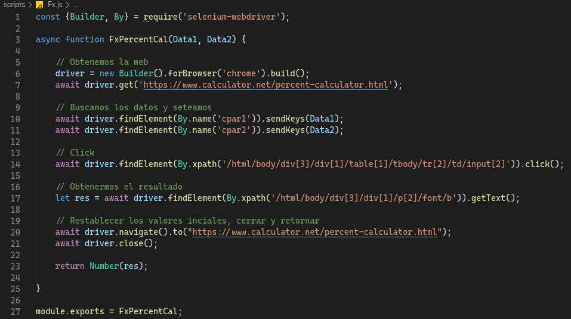
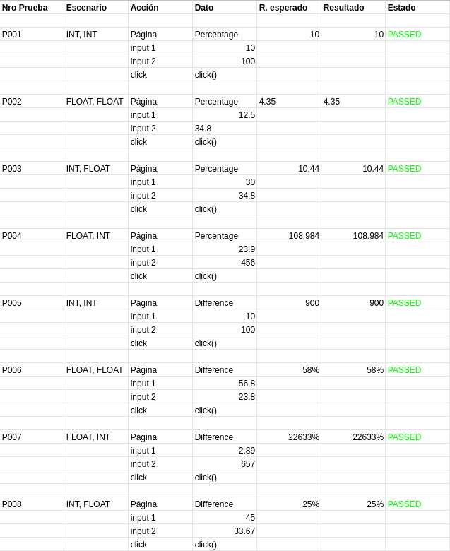
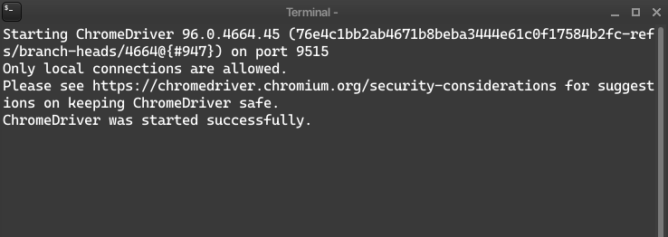
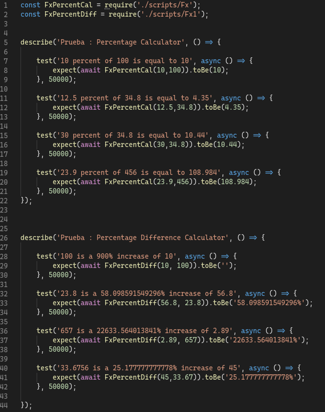
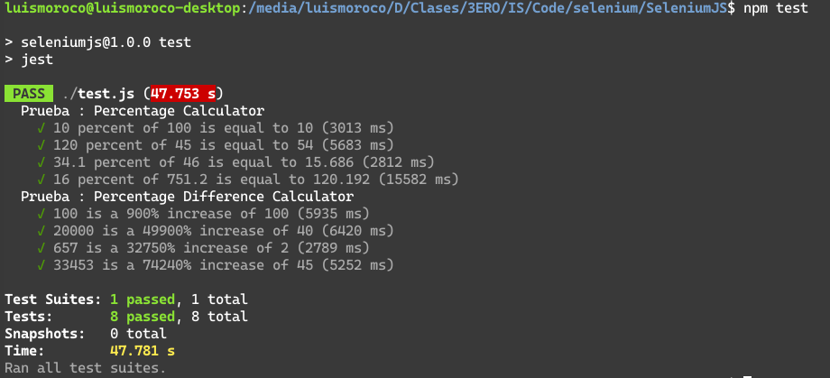

# Laboratory 05: Functional testing with Selenium Web driver + Jest

In this lab we will automate functional tests using Selenium Web driver for a Web Calculator, to obtain reports we will use Jest.

<https://www.calculator.net/percent-calculator.html>

## Pre - requeriments

1. Chrome Browser
2. Selenium Web Driver for Chrome
3. NodeJS 
4. NPM or YARN

## Activities

### 1. Implementing Test Cases for the "Percentage Calculator" functionality

* Design test cases: Inputs, process, Expected Result
* Implement the Selenium scripts in the `scripts/Fx.js` and `scripts/Fx1.js` file.

* Report performance results

### 2. Configuring browser-specific WebDriver 

* Download Selenium Driver Web for Chrome from the page and then unzip it   <https://chromedriver.storage.googleapis.com/index.html>

* Adding the directory to the system PATH for Windows

    > `setx PATH "%PATH%;C:\WebDriver\bin"`

* Adding the directory to the system PATH for Linux Ubuntu

    > `export PATH=$PATH:/opt/WebDriver/bin >> ~/.profile`

* Now we will run the script, and the server will run

    

### 3. Integrate with xUnit

* Installation of Jest using NPM
    > `npm i --save-dev jest`

* Test script, file will contain four tests to two different forms `test.js`

    

* Console report of the results:

    

### 3. Setup 

* Clone Repository `git clone https://github.com/luismoroco/Selenium-Jest.git`.
* Enter the directory `cd <LOCAL REPOSITORY>`.
* Install modules `npm install`.
* Start testing `npm test`.
* Happy Hacking!